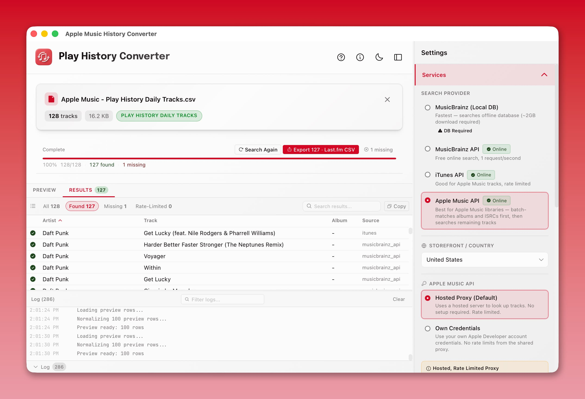

# Apple Music Play History Converter

Convert your Apple Music play history CSV exports into formats compatible with Last.fm, Spotify, ListenBrainz, and more.



## Download

Download the latest release for your platform from the [Releases](https://github.com/nerveband/Apple-Music-Play-History-Converter/releases) page:

- **macOS** — `.dmg` (signed and notarized)
- **Windows** — `.msi` installer or `.exe` (NSIS)

## Features

- **Load any Apple Music CSV export** — Play Activity, Recently Played Tracks, or Play History Daily Tracks
- **Preview and edit** before searching — fix artist/track/album names inline with resizable columns
- **4 search providers** with real-time status badges:
  - iTunes API
  - MusicBrainz API
  - MusicBrainz Local Database (offline, fastest)
  - Apple Music API (via shared proxy)
- **5 export formats**: Last.fm CSV, Spotify CSV, Universal CSV, iTunes XML, ListenBrainz JSON
- **Smart rate limiting** — per-provider controls, pause/resume, skip wait
- **Resume support** — stop and pick up where you left off
- **Retry workflows** — re-search missing or rate-limited tracks with any provider
- **Album matching** — all providers return album data when available
- Dark and light mode

## How to Get Your Apple Music Data

1. Go to [privacy.apple.com](https://privacy.apple.com)
2. Sign in and select **Request a copy of your data**
3. Select **Apple Media Services information** (this includes Apple Music)
4. Choose your preferred file size and submit
5. Wait for Apple to prepare your data (usually 1-7 days)
6. Download and unzip — look for CSV files like `Apple Music - Play History Daily Tracks.csv`

## Usage

1. Open the app and load your CSV file (drag and drop or click to browse)
2. Preview your tracks — edit any incorrect entries
3. Choose a search provider from the sidebar
4. Click **Search** and watch progress in real-time
5. Export your results in your preferred format

## Building from Source

### Prerequisites

- Node.js 20+
- Rust toolchain (via [rustup](https://rustup.rs))
- Python 3.8+

### Setup

```bash
cd tauri-app
npm install

cd python-sidecar
python3 -m venv .venv
source .venv/bin/activate
pip install -r requirements.txt
```

### Release Packaging

- `npm run tauri build` now runs `npm run build:release`, which builds the React app and a bundled Python sidecar binary for macOS and Windows.
- Windows bundles also use Tauri's offline WebView2 installer so first-time installs do not depend on an existing WebView runtime or live network bootstrap.
- macOS bundles default to ad-hoc signing for local/test builds. Set `APPLE_SIGNING_IDENTITY="Developer ID Application: ..."` when you need a properly signed release build, and notarize that release artifact before distribution.
- Development still uses `tauri-app/python-sidecar/sidecar.py` directly.
- Release builds are expected to be self-contained and should not depend on end users installing Python or `pip` packages manually.

### Run in development

```bash
cd tauri-app
npm run tauri dev
```

### Build for production

```bash
cd tauri-app
npm run tauri build
```

The built app will be in `tauri-app/src-tauri/target/release/bundle/`.

If a user reports startup/search/download issues, ask them to open the app's logs folder from the Advanced section and send the latest session log. On macOS this is `~/Library/Logs/AppleMusicConverter`.

## Testing

```bash
# Frontend tests
cd tauri-app && npm run test

# Rust compilation check
cd tauri-app/src-tauri && cargo check

# Python sidecar tests
cd tauri-app/python-sidecar && python3 test_sidecar.py
```

## Project Layout

```
tauri-app/                          Tauri application
  src/                              React + TypeScript frontend
  src-tauri/                        Rust backend
  python-sidecar/                   Python sidecar (search/export engine)
src/apple_music_history_converter/  Shared Python backend modules
cloudflare-worker/                  Apple Music API proxy (Cloudflare Workers)
```

## License

MIT
